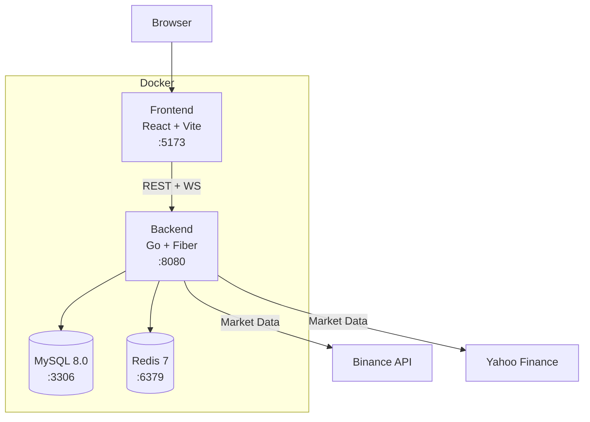

# trader-claude

> Full-stack market backtesting, live monitoring, and AI-assisted trading research platform.

[](https://github.com/mehrdadmahdian/trader-claude/actions/workflows/ci.yml)

## Features

- **Backtesting** — Run strategies (EMA Crossover, RSI, MACD) against historical data with full performance metrics
- **Live Monitoring** — Real-time market monitors with configurable strategy signals and WebSocket alerts
- **Paper Trading** — Auto-execute monitor signals against a virtual portfolio
- **Advanced Analytics** — Parameter heatmaps, Monte Carlo simulation, walk-forward analysis, run comparison
- **AI Assistant** — Context-aware chatbot (OpenAI / Ollama) for market analysis
- **Social Sharing** — Generate and share backtest cards via Telegram
- **Portfolio Tracking** — Live portfolio with P&L, positions, and transaction history
- **Price Alerts** — Configurable price level alerts with in-app and Telegram notifications
- **Market Data** — Binance (crypto) and Yahoo Finance (stocks) adapters
- **Replay Mode** — Step through a backtest candle-by-candle

## Architecture



## Quick Start

**Prerequisites:** Docker + Docker Compose

```bash
# 1. Clone
git clone https://github.com/mehrdadmahdian/trader-claude.git
cd trader-claude

# 2. Configure environment
cp .env.example .env
# Edit .env — add BINANCE_API_KEY if you want live crypto data

# 3. Start all services
make up

# 4. Open the app
open http://localhost:5173
```

Verify health:
```bash
curl http://localhost:8080/health
```

Seed demo data (optional):
```bash
make seed
```

## Environment Variables

| Variable | Default | Description |
|---|---|---|
| `APP_ENV` | `development` | Environment mode (production/development) |
| `APP_PORT` | `8080` | Backend HTTP port |
| `DB_HOST` | `mysql` | MySQL hostname |
| `DB_PORT` | `3306` | MySQL port |
| `DB_USER` | `trader` | MySQL username |
| `DB_PASSWORD` | `trader_pass` | MySQL password |
| `DB_NAME` | `trader_claude` | MySQL database |
| `REDIS_HOST` | `redis` | Redis hostname |
| `REDIS_PORT` | `6379` | Redis port |
| `BINANCE_API_KEY` | — | Binance API key (optional) |
| `BINANCE_API_SECRET` | — | Binance API secret |
| `OPENAI_API_KEY` | — | OpenAI API key for AI assistant |
| `OPENAI_MODEL` | `gpt-4o-mini` | OpenAI model to use |
| `OLLAMA_URL` | `http://ollama:11434` | Ollama base URL (local LLM) |
| `TELEGRAM_BOT_TOKEN` | — | Telegram bot token for notifications |
| `TELEGRAM_CHAT_ID` | — | Telegram chat ID for alerts |
| `CORS_ORIGINS` | `http://localhost:5173` | Allowed CORS origins |
| `VITE_API_URL` | `http://localhost:8080` | Frontend API base URL |
| `VITE_WS_URL` | `ws://localhost:8080` | Frontend WebSocket URL |
| `WORKER_POOL_SIZE` | `10` | Number of worker goroutines |
| `JWT_SECRET` | — | JWT signing secret (required in production) |

## Makefile Reference

```bash
# Docker
make up                # Start all services
make down              # Stop all services
make logs              # Tail live logs
make restart           # Restart services
make down-v            # Stop + remove volumes (⚠️ deletes data)

# Development
make backend-shell     # Open Go container shell
make frontend-shell    # Open React container shell
make backend-fmt       # Format Go code
make frontend-fmt      # Format TypeScript
make backend-test      # Run Go tests
make frontend-test     # Run Vitest tests
make backend-lint      # Run golangci-lint
make frontend-lint     # Run ESLint

# Database
make migrate            # Run migrations
make db-shell          # MySQL CLI (trader user)
make db-root           # MySQL CLI (root user)
make seed              # Seed demo data
```

## Tech Stack

| Layer | Technology |
|---|---|
| **Backend** | Go 1.24, Fiber v2, GORM |
| **Database** | MySQL 8.0 (BIGINT PKs, JSON columns) |
| **Cache** | Redis 7 (AOF + RDB persistence) |
| **Frontend** | React 18, TypeScript, Vite 5 |
| **Styling** | TailwindCSS v3, shadcn/ui (Radix) |
| **State** | Zustand, React Query v5 |
| **Charts** | Recharts, lightweight-charts |
| **Icons** | lucide-react |
| **Hot Reload** | Air (backend), Vite HMR (frontend) |

## Project Structure

```
trader-claude/
├── backend/
│   ├── cmd/server/main.go         # Entry point
│   ├── internal/
│   │   ├── api/                   # HTTP handlers + routes
│   │   ├── adapter/               # Market data adapters (Binance, Yahoo)
│   │   ├── strategy/              # Trading strategies (EMA, RSI, MACD)
│   │   ├── models/                # GORM models
│   │   ├── registry/              # Adapter & Strategy registries
│   │   ├── ws/                    # WebSocket hub
│   │   ├── worker/                # Goroutine pool
│   │   ├── monitor/               # Live monitor engine
│   │   ├── backtest/              # Backtest runner
│   │   ├── alert/                 # Price alert evaluator
│   │   ├── news/                  # News aggregation
│   │   ├── price/                 # Price service
│   │   ├── replay/                # Replay mode
│   │   ├── ai/                    # AI assistant
│   │   └── config/                # Env config loader
│   ├── migrations/                # SQL migrations
│   ├── go.mod & go.sum
│   └── Dockerfile
├── frontend/
│   ├── src/
│   │   ├── components/            # Reusable UI components
│   │   ├── pages/                 # Page components
│   │   ├── stores/                # Zustand stores
│   │   ├── types/                 # TypeScript interfaces
│   │   ├── api/                   # Axios client
│   │   └── lib/                   # Utilities
│   ├── package.json
│   ├── vite.config.ts
│   └── Dockerfile
├── docker/                        # Nginx, MySQL, Redis configs
├── .claude/
│   ├── CLAUDE.md                  # Claude project instructions
│   └── docs/
│       ├── architecture.md        # System design
│       ├── api.md                 # Full API reference
│       ├── database.md            # Schema & conventions
│       ├── websocket.md           # WS protocol
│       ├── adding-a-market.md     # Market adapter tutorial
│       └── adding-a-strategy.md   # Strategy tutorial
├── docker-compose.yml
├── Makefile
└── README.md                      # ← You are here
```

## Extension Guides

- **[Adding a Market Adapter](.claude/docs/adding-a-market.md)** — Create a new data source (e.g., Kraken, IB, Interactive Brokers)
- **[Adding a Trading Strategy](.claude/docs/adding-a-strategy.md)** — Create a new strategy (e.g., Bollinger Bands, Stochastic)

## Contributing

See [CONTRIBUTING.md](CONTRIBUTING.md).

## Conventions

- **Go**: Single-file model (`internal/models/models.go`), handlers in `internal/api/`, adapters in `internal/adapter/`
- **React**: All TS interfaces in `types/index.ts`, all stores in `stores/index.ts`, components in `components/`
- **Database**: MySQL 8.0, `utf8mb4`, `BIGINT AUTO_INCREMENT` PKs, `DECIMAL(20,8)` for prices
- **API**: `/api/v1/*` base path, JSON responses, error format `{error: "message"}`
- **WebSocket**: Subscriptions to `ticks:*`, `candles:*`, `alerts:*`, `signals:*`
- **Commit messages**: Conventional Commits with phase prefix (e.g., `feat(phase8): add monitor routes`)

## CI/CD

The project includes GitHub Actions workflows:
- **`ci.yml`** — Runs on PR: `go test`, `go vet`, `eslint`, `prettier` checks
- **Docker builds** — Multi-stage, production-optimized

## License

MIT — see [LICENSE](LICENSE).

## Support

For questions or issues:
1. Check the [Architecture Guide](.claude/docs/architecture.md)
2. Review the [API Reference](.claude/docs/api.md)
3. Open an issue on GitHub
