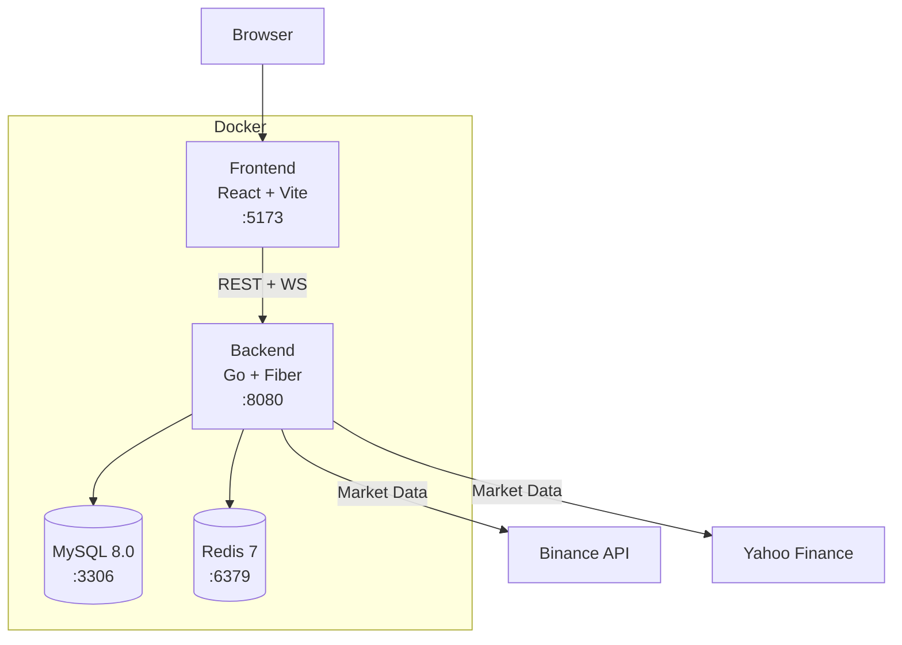

# Phase 12 — Open Source Polish & CI — Atomic Implementation Plan

> **For Claude:** REQUIRED SUB-SKILL: Use superpowers:executing-plans to implement this plan task-by-task.

**Goal:** Prepare the project for open-source release with comprehensive documentation, GitHub CI/CD pipeline, demo seed data, and a bonus paper trading mode for monitors.

**Architecture:** No new backend packages — this phase adds documentation files, CI configuration, a seed command, and extends existing Monitor functionality. Paper trading extends `monitor/poller.go` to auto-execute signals as transactions in a virtual portfolio.

**Tech Stack:** Go 1.24, React 18, GitHub Actions, Docker Compose, golangci-lint.

**Design doc:** `docs/plans/2026-02-27-phase12-polish-ci-design.md`

---

## DOCUMENTATION TASKS

---

### Task D1: Create README.md

**Files to create:**
- `README.md`

---

**Step 1: Create a comprehensive README**

Structure:
- **Header**: Project name + one-line description
- **Features**: Bullet list of all 12 phases with brief descriptions
- **Architecture**: Mermaid diagram showing Docker services + data flow
- **Quick Start**: 4 steps (clone, env, make up, open browser)
- **Environment Variables**: Table of all env vars from `.env.example`
- **Extension Guides**: Links to adding-a-market.md and adding-a-strategy.md
- **Tech Stack**: Go 1.24, React 18, MySQL 8, Redis 7, Docker
- **Contributing**: Link to CONTRIBUTING.md
- **License**: MIT

Architecture Mermaid diagram:



---

**Step 2: Commit**

```bash
git add README.md
git commit -m "docs(phase12): add comprehensive README with architecture diagram"
```

---

### Task D2: Create CONTRIBUTING.md

**Files to create:**
- `CONTRIBUTING.md`

---

**Step 1: Create contributing guide**

Sections:
- Development Setup (prerequisites, Docker, make up)
- Code Style (gofmt, golangci-lint, eslint, prettier)
- Commit Messages (conventional commits: feat/fix/docs/test/chore)
- Branch Naming (feature/phase-N-description, fix/issue-description)
- Pull Request Process (fork, branch, implement, test, PR)
- Testing (backend: `make backend-test`, frontend: `make frontend-test`)
- Adding Features (link to extension guides)

---

**Step 2: Commit**

```bash
git add CONTRIBUTING.md
git commit -m "docs(phase12): add CONTRIBUTING guide"
```

---

### Task D3: Create extension guide — Adding a Market Adapter

**Files to create:**
- `.claude/docs/adding-a-market.md`

---

**Step 1: Write the guide**

Full tutorial with:
1. Create `backend/internal/adapter/{name}/adapter.go`
2. Implement `registry.MarketAdapter` interface (Name, Markets, FetchCandles, FetchSymbols, SubscribeTicks, IsHealthy)
3. Full code example showing a minimal adapter
4. Register in `backend/cmd/server/main.go`: `registry.Adapters().Register("name", adapter.New())`
5. Add API key to `.env.example` if needed
6. Test: `docker compose exec backend go test ./internal/adapter/{name}/... -v`

---

**Step 2: Commit**

```bash
git add .claude/docs/adding-a-market.md
git commit -m "docs(phase12): add guide for creating new market adapters"
```

---

### Task D4: Create extension guide — Adding a Strategy

**Files to create:**
- `.claude/docs/adding-a-strategy.md`

---

**Step 1: Write the guide**

Full tutorial with:
1. Create `backend/internal/strategy/{name}/strategy.go`
2. Implement `registry.Strategy` interface (Name, Description, Params, Init, OnCandle, OnTick, Reset)
3. Define `Params()` with `ParamDefinition` for auto-generated frontend UI
4. Full code example (e.g., simple moving average crossover)
5. Register in `main.go`: `registry.Strategies().Register("name", strategy.New)`
6. Test: write unit test with sample candles

---

**Step 2: Commit**

```bash
git add .claude/docs/adding-a-strategy.md
git commit -m "docs(phase12): add guide for creating new trading strategies"
```

---

## CI/CD TASKS

---

### Task C1: Create GitHub issue and PR templates

**Files to create:**
- `.github/ISSUE_TEMPLATE/bug_report.md`
- `.github/ISSUE_TEMPLATE/feature_request.md`
- `.github/pull_request_template.md`

---

**Step 1: Create bug report template**

```markdown
---
name: Bug Report
about: Report a bug or unexpected behavior
title: '[Bug] '
labels: bug
---

## Description
A clear description of the bug.

## Steps to Reproduce
1. Go to '...'
2. Click on '...'
3. See error

## Expected Behavior
What should happen.

## Actual Behavior
What actually happens.

## Environment
- OS: [e.g., macOS 15]
- Docker version: [e.g., 24.0]
- Browser: [e.g., Chrome 120]

## Screenshots
If applicable.
```

---

**Step 2: Create feature request template**

```markdown
---
name: Feature Request
about: Suggest a new feature or improvement
title: '[Feature] '
labels: enhancement
---

## Description
A clear description of the feature.

## Use Case
Why this feature is needed.

## Proposed Solution
How you think it should work.

## Alternatives Considered
Other approaches you've considered.
```

---

**Step 3: Create PR template**

```markdown
## Description
Brief description of changes.

## Type of Change
- [ ] Bug fix
- [ ] New feature
- [ ] Breaking change
- [ ] Documentation

## Testing
- [ ] `make backend-test` passes
- [ ] `make frontend-test` passes
- [ ] `make backend-lint` passes
- [ ] `make frontend-lint` passes

## Screenshots
If UI changes.
```

---

**Step 4: Commit**

```bash
git add .github/
git commit -m "docs(phase12): add GitHub issue and PR templates"
```

---

### Task C2: Create .github/workflows/ci.yml

**Files to create:**
- `.github/workflows/ci.yml`

---

**Step 1: Create CI workflow**

Three jobs:
1. **backend**: Setup Go 1.24, MySQL 8 + Redis 7 services, run `go vet`, `golangci-lint`, `go test ./... -race -coverprofile`
2. **frontend**: Setup Node 20, `npm ci`, `eslint`, `tsc --noEmit`, `vitest run`
3. **docker**: Build check with `docker compose build`

Triggers: push to `main`, pull requests to `main`.

---

**Step 2: Add golangci-lint config**

Create `backend/.golangci.yml`:

```yaml
linters:
  enable:
    - errcheck
    - gosimple
    - govet
    - ineffassign
    - staticcheck
    - unused
  disable:
    - depguard

linters-settings:
  errcheck:
    check-type-assertions: true

run:
  timeout: 5m
```

---

**Step 3: Commit**

```bash
git add .github/workflows/ci.yml backend/.golangci.yml
git commit -m "ci(phase12): add GitHub Actions CI pipeline for backend, frontend, and Docker"
```

---

## SEED DATA TASKS

---

### Task S1: Create backend/cmd/seed/main.go

**Read first:**
- `backend/cmd/server/main.go` (config loading pattern)
- `backend/internal/adapter/dataservice.go` (GetCandles signature)

**Files to create:**
- `backend/cmd/seed/main.go`

---

**Step 1: Create seed script**

```go
package main

import (
	"context"
	"log"
	"time"

	"github.com/trader-claude/backend/internal/adapter"
	"github.com/trader-claude/backend/internal/config"
	"github.com/trader-claude/backend/internal/models"
	"github.com/trader-claude/backend/internal/registry"
	// Import adapters for side-effect registration
	_ "github.com/trader-claude/backend/internal/adapter/binance"
	_ "github.com/trader-claude/backend/internal/adapter/yahoo"
)

func main() {
	cfg := config.Load()
	db := config.ConnectDB(cfg)
	ds := adapter.NewDataService(db)
	ctx := context.Background()

	log.Println("=== Seeding trader-claude demo data ===")

	seedCandles(ctx, ds)
	seedPortfolio(ctx, db)
	seedMonitor(ctx, db)
	seedAlerts(ctx, db)
	seedNews(ctx, db)

	log.Println("=== Seed complete! ===")
}

func seedCandles(ctx context.Context, ds *adapter.DataService) {
	symbols := []struct {
		adapterID string
		symbol    string
		market    string
	}{
		{"binance", "BTCUSDT", "crypto"},
		{"binance", "ETHUSDT", "crypto"},
		{"binance", "SOLUSDT", "crypto"},
		{"yahoo", "AAPL", "stock"},
		{"yahoo", "MSFT", "stock"},
		{"yahoo", "SPY", "stock"},
	}

	now := time.Now().UTC()
	oneYearAgo := now.AddDate(-1, 0, 0)

	for _, s := range symbols {
		log.Printf("Fetching candles: %s/%s (%s)...", s.symbol, s.market, s.adapterID)
		adapt, err := registry.Adapters().Get(s.adapterID)
		if err != nil {
			log.Printf("  SKIP: adapter %q not registered: %v", s.adapterID, err)
			continue
		}
		candles, err := ds.GetCandles(ctx, adapt, s.symbol, s.market, "1d", oneYearAgo, now)
		if err != nil {
			log.Printf("  ERROR: %v", err)
			continue
		}
		log.Printf("  OK: %d candles", len(candles))
	}
}

func seedPortfolio(ctx context.Context, db interface{ Create(interface{}) interface{ Error() error } }) {
	log.Println("Seeding demo portfolio...")
	// Create portfolio + 3 positions via GORM
	// BTCUSDT: 0.5 BTC @ $40,000
	// ETHUSDT: 5 ETH @ $2,200
	// AAPL: 10 shares @ $175
}

func seedMonitor(ctx context.Context, db interface{ Create(interface{}) interface{ Error() error } }) {
	log.Println("Seeding demo monitor...")
	// Create 1 active monitor: EMA Crossover on BTCUSDT 1h
}

func seedAlerts(ctx context.Context, db interface{ Create(interface{}) interface{ Error() error } }) {
	log.Println("Seeding demo alerts...")
	// Create 2 alerts: BTCUSDT price > $100,000 and ETHUSDT RSI oversold
}

func seedNews(ctx context.Context, db interface{ Create(interface{}) interface{ Error() error } }) {
	log.Println("Seeding demo news...")
	// Create 5 realistic news items with symbol tags
}
```

Note: The above is a skeleton. The actual implementation should use `*gorm.DB` and create real model instances. The specific `seedPortfolio`, `seedMonitor`, etc. functions will create `models.Portfolio`, `models.Monitor`, `models.Alert`, and `models.NewsItem` records.

---

**Step 2: Add Makefile target**

Append to `Makefile`:

```makefile
seed:
	docker compose exec backend go run ./cmd/seed/main.go
```

---

**Step 3: Test the seed script**

```bash
make seed
```

Expected: Script logs success for each seed category.

---

**Step 4: Commit**

```bash
git add backend/cmd/seed/ Makefile
git commit -m "feat(phase12): add seed script with demo data for all features"
```

---

## PAPER TRADING TASKS

---

### Task P1: Add Mode + PaperPortfolioID to Monitor model

**Read first:**
- `backend/internal/models/models.go` (Monitor struct)

**Files to modify:**
- `backend/internal/models/models.go`

---

**Step 1: Add fields to Monitor struct**

After the `NotifyInApp` field in Monitor:

```go
Mode             string `gorm:"type:varchar(20);not null;default:'live_alert'" json:"mode"` // "live_alert" | "paper_trade"
PaperPortfolioID *int64 `gorm:"index" json:"paper_portfolio_id,omitempty"`
```

---

**Step 2: Verify compile + commit**

```bash
make backend-fmt && docker compose exec backend go build ./...
git add backend/internal/models/models.go
git commit -m "feat(phase12): add Mode and PaperPortfolioID to Monitor model"
```

---

### Task P2: Add executePaperTrade to monitor/poller.go

**Read first:**
- `backend/internal/monitor/poller.go` (emitSignal function)
- `backend/internal/models/models.go` (Portfolio, Transaction structs)

**Files to modify:**
- `backend/internal/monitor/poller.go`

---

**Step 1: Add paper trade execution after signal emission**

In `emitSignal`, after the notification creation block, add:

```go
if mon.Mode == "paper_trade" && mon.PaperPortfolioID != nil {
    executePaperTrade(ctx, db, mon, sig)
}
```

Create `executePaperTrade` function:

```go
func executePaperTrade(ctx context.Context, db *gorm.DB, mon models.Monitor, sig *registry.Signal) {
    // Load portfolio
    var portfolio models.Portfolio
    if err := db.WithContext(ctx).First(&portfolio, *mon.PaperPortfolioID).Error; err != nil {
        log.Printf("[monitor %d] paper trade: portfolio not found: %v", mon.ID, err)
        return
    }

    // Determine action based on signal direction
    var txnType string
    switch sig.Direction {
    case "long":
        txnType = "buy"
    case "short":
        txnType = "sell"
    default:
        return
    }

    // Create transaction
    txn := models.Transaction{
        PortfolioID: *mon.PaperPortfolioID,
        Symbol:      mon.Symbol,
        Type:        txnType,
        Quantity:    calculateQuantity(portfolio.CurrentCash, sig.Price),
        Price:       sig.Price,
    }
    if err := db.WithContext(ctx).Create(&txn).Error; err != nil {
        log.Printf("[monitor %d] paper trade: create txn failed: %v", mon.ID, err)
        return
    }

    log.Printf("[monitor %d] paper trade: %s %s @ $%.4f", mon.ID, txnType, mon.Symbol, sig.Price)
}

func calculateQuantity(cash, price float64) float64 {
    if price <= 0 {
        return 0
    }
    // Use 10% of available cash per trade
    allocation := cash * 0.1
    return allocation / price
}
```

---

**Step 2: Verify compile + tests + commit**

```bash
make backend-fmt && docker compose exec backend go build ./...
make backend-test
git add backend/internal/monitor/poller.go
git commit -m "feat(phase12): add paper trade execution on monitor signals"
```

---

### Task P3: Frontend — add Mode toggle to Create Monitor modal

**Read first:**
- `frontend/src/pages/Monitor.tsx` (CreateMonitorModal component)

**Files to modify:**
- `frontend/src/pages/Monitor.tsx`
- `frontend/src/types/index.ts` (update MonitorCreateRequest)

---

**Step 1: Update MonitorCreateRequest type**

Add to `MonitorCreateRequest`:

```ts
mode?: 'live_alert' | 'paper_trade'
```

Update `Monitor` interface:

```ts
mode: 'live_alert' | 'paper_trade'
paper_portfolio_id?: number
```

---

**Step 2: Add mode toggle to CreateMonitorModal**

Add a toggle/radio group between "Live Alert" and "Paper Trade" modes in the create form. When "Paper Trade" is selected, the backend will auto-create a paper portfolio.

---

**Step 3: Update MonitorCard to show mode badge**

Show a small "PAPER" or "LIVE" badge on the monitor card header.

---

**Step 4: Verify + commit**

```bash
make frontend-lint
make frontend-test
git add frontend/src/pages/Monitor.tsx frontend/src/types/index.ts
git commit -m "feat(phase12): add paper trading mode toggle to Monitor page"
```

---

### Task P4: Create .env.example

**Files to create:**
- `.env.example`

---

**Step 1: Create the file**

```env
# Database
DB_HOST=mysql
DB_PORT=3306
DB_USER=trader
DB_PASSWORD=trader_pass
DB_NAME=trader_claude

# Redis
REDIS_HOST=redis
REDIS_PORT=6379

# Backend
APP_PORT=8080
APP_VERSION=dev

# Market Data Adapters
BINANCE_API_KEY=
BINANCE_API_SECRET=
# Yahoo Finance uses no authentication

# AI Assistant (Phase 10)
OPENAI_API_KEY=
OPENAI_MODEL=gpt-4o-mini
OLLAMA_URL=http://ollama:11434
OLLAMA_MODEL=llama3.2

# Telegram Bot (Phase 9)
TELEGRAM_BOT_TOKEN=
TELEGRAM_CHAT_ID=

# Frontend
VITE_API_URL=http://localhost:8080
VITE_WS_URL=ws://localhost:8080
```

---

**Step 2: Commit**

```bash
git add .env.example
git commit -m "docs(phase12): add .env.example with all environment variables"
```

---

### Task P5: Create LICENSE

**Files to create:**
- `LICENSE`

---

**Step 1: MIT License**

Standard MIT license text with current year and project name.

---

**Step 2: Commit**

```bash
git add LICENSE
git commit -m "docs(phase12): add MIT license"
```

---

## Final Verification

**Step 1: Run full test suite**

```bash
make backend-test
make frontend-test
make backend-lint
make frontend-lint
```

**Step 2: Build check**

```bash
docker compose build
```

**Step 3: Seed + smoke test**

```bash
make up
make seed
# Verify: http://localhost:5173 loads with seeded data
# Verify: 6 symbols with candles, demo portfolio, 1 monitor, 2 alerts
```

**Step 4: Update phases.md**

Mark Phase 12 complete:
```
## Phase 12 — Open Source Polish & CI ✅ COMPLETE
```

---

## Summary

| Task | Files | Description |
|---|---|---|
| D1 | README.md | Comprehensive README with Mermaid architecture diagram |
| D2 | CONTRIBUTING.md | Contributing guide |
| D3 | .claude/docs/adding-a-market.md | Market adapter extension guide |
| D4 | .claude/docs/adding-a-strategy.md | Strategy extension guide |
| C1 | .github/ISSUE_TEMPLATE/*, .github/pull_request_template.md | Issue + PR templates |
| C2 | .github/workflows/ci.yml, backend/.golangci.yml | GitHub Actions CI pipeline |
| S1 | backend/cmd/seed/main.go, Makefile | Seed script with demo data |
| P1 | models.go | Add Mode + PaperPortfolioID to Monitor |
| P2 | monitor/poller.go | Paper trade execution on signals |
| P3 | Monitor.tsx, types/index.ts | Paper trading mode toggle in UI |
| P4 | .env.example | Environment variable documentation |
| P5 | LICENSE | MIT license |
